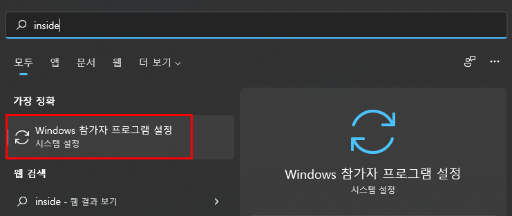
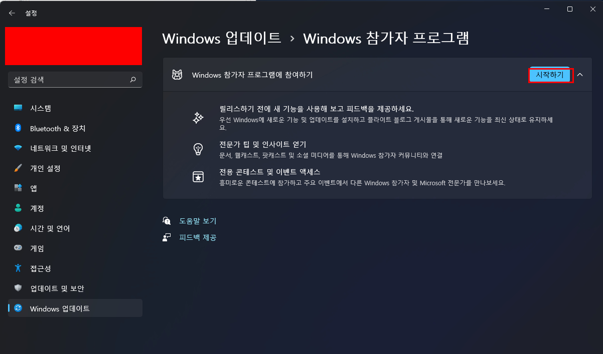
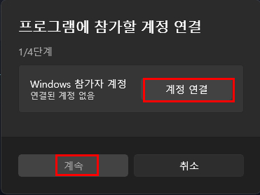
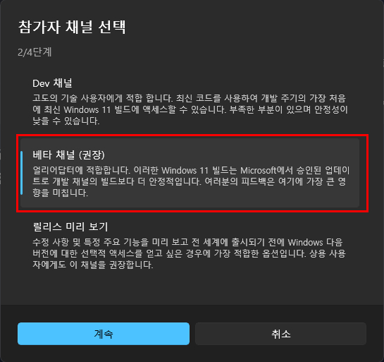
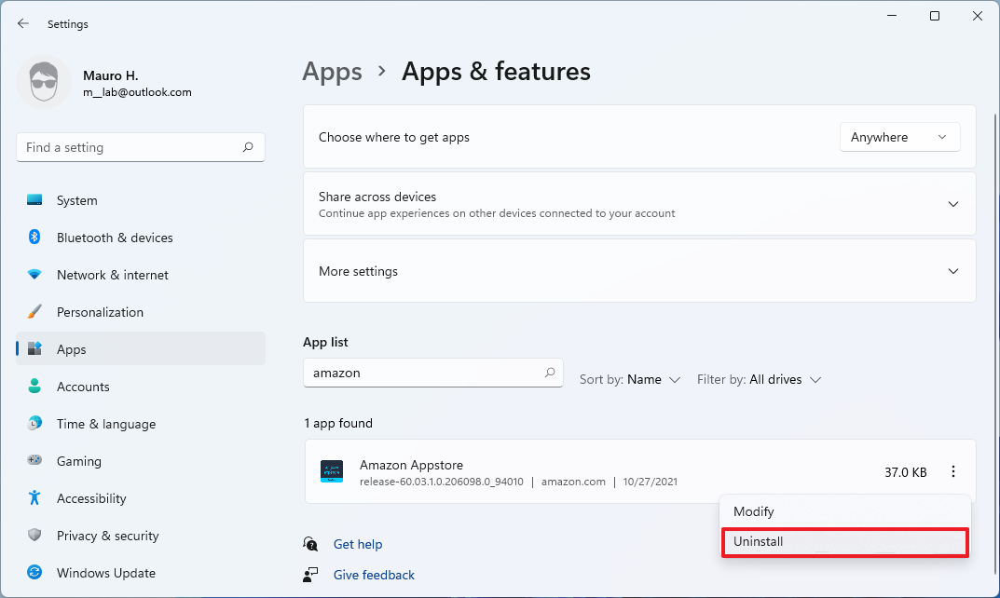
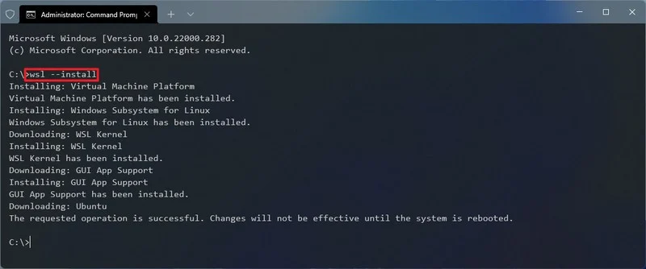
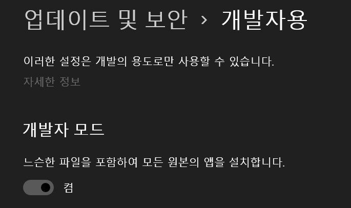

# 목차

- [1. 개요](#개요)

* [2. 준비물](#준비물)

* [3. 설치 방법](#설치-방법)

# 개요

이 글은 한국어 사용자를 위한 GApps 설치 설명서 입니다.

# 준비물

1. 컴퓨터에 Windows 11이 설치되어 있어야 합니다. [하드웨어 요구사항 확인하기]

1. HYPER-V가 활성화 되어 있어야 합니다.

1. [링크]에서 필요한 파일들을 다운로드 합니다.

# 설치 방법

## WSA를 설치한 적이 없다면

### Windows 참가자 프로그램 설정

Windows 참가자 프로그램은 아래와 같은 방법으로 설정할 수 있습니다.

1. 시작 > Windows 참가자 프로그램 설정
   

1. Windows 참가자 프로그램에 참여하기 > 시작하기
   

1. 마이크로소프트 계정과 연결, 베타 채널 선택

   
   

1. 이후 재부팅 하면 설정이 완료됩니다.

## WSA가 설치되어 있다면

설정 > 앱 > 앱 및 기능에서 Amazon Appstore를 삭제해 주어야 합니다.


## 작업 환경 설정

### WSL2 설치

1. 시작 버튼을 우클릭 하여 Windows 터미널 (관리자) 를 실행합니다.

1. 아래의 명령어를 입력하여 WSL을 설치합니다.

```
wsl --install
```



1. 설치가 완료되면 재부팅 이후 설정을 완료합니다.

### 개발자 설정 활성화

1. 설정을 실행합니다.

1. 업데이트 및 보안 > 개발자용 메뉴에서 개발자 모드를 활성화 합니다.



### 폴더 생성

1. 파일 관리자를 열어 C드라이브 를 엽니다.

1. 아래의 이름들로 폴더를 생성합니다.

```
ADBKit

GAppsWSA

WindowsSubsystemAndroid

```

![8]

## WSA 설치

### WindowsSubsystemAndroid 폴더 설정

1. [준비물](#준비물)에서 다운로드 한 파일 중 아래의 파일을 아까 만들어 둔 C:\WindowsSubsystemAndroid 폴더에 압축 해제 합니다.

```
WsaPackage_1.7.32815.0_x64_Release-Nightly
```

![9]

1. C:\WindowsSubsystemAndroid 폴더에 들어가 아래의 파일들을 삭제합니다.

```
AppxMetaData (폴더)

AppxBlockMap.xml

AppxSignature.p7x

Content_Type.xml
```

### GappsWSA 폴더 설정

1. 위에서 다운로드 한 파일 중, WSAGAScript 폴더의 내용물을 C:\GappsWSA 폴더로 이동합니다.

1. 다운로드한 파일 중 open_gapps-x86_64-11.0-pico-20211029.zip 파일을 아래의 폴더에 압축해제 합니다.

```
C:\GAppsWSA\#GAPPS
```

![10]

### ADBKit 폴더 설정

1. 다운로드한 파일 중, ADBKit.zip 파일을 C:\ADBKit 폴더에 압축 해제 합니다.

![11]

### 이미지 파일 복사

1. C:\WindowsSubSystemAndroid 폴더에 들어가 아래의 파일들을 복사합니다.

```
vendor.img
system_ext.img
system.img
product.img
```

1. 복사한 파일들을 아래의 폴더에 붙여넣습니다.

```
C:\GAppsWSA\#IMAGES
```

![12]

### WSA 설정

1. 시작 화면을 열어 Ubuntu를 검색 후 실행합니다.

1. 아래의 명령어를 순서대로 입력합니다.

```
sudo su

cd /mnt/c/GappsWSA

sudo apt-get update

sudo apt-get install unzip lzip

sudo apt-get install dos2unix

dos2unix ./apply.sh

dos2unix ./extend_and_mount_images.sh

dos2unix ./extract_gapps_pico.sh

dos2unix ./unmount_images.sh

dos2unix ./VARIABLES.sh

./extract_gapps_pico.sh

./extend_and_mount_images.sh

./apply.sh

./unmount_images.sh
```

![13]
![14]
![15]
![16]
![17]

1. 파일 관리자로 C:\GAppsWSA\#IMAGES 폴더에 들어갑니다.

1. 아래의 파일들을 복사하여 C:\WindowsSubsystemAndroid 폴더에 붙여넣습니다.

```
vendor.img

system_ext.img

system.img

product.img
```

1. 파일 덮어쓰기 메뉴를 선택합니다.

![18]

1. C:\GAppsWSA\misk 폴더에서 kernal 파일을 복사합니다.

1. C:\WindowsSubsystemAndroid\Tools 폴더에 있는 kernal 파일의 이름을 kernal_bak으로 변경합니다.

1. 아까 복사해둔 kernal 파일을 붙여넣습니다.

![19]

## WSA 설치

1. 시작 메뉴에서 Powershell을 검색하여 관리자 권한으로 실행합니다.

1. 아래의 명령어를 입력합니다.

```
Add-AppxPackage -Register C:\WindowsSubsystemAndroid\AppxManifest.xml
```

![20]

## Play 스토어 설치

1. 시작 메뉴에서 Windows Subsystem for Android 를 실행합니다.

1. Developer mode 를 설정합니다.

![21]

1. Manage developer settings에 들어가 Share my diagnostic data의 체크를 해제한 후, Continue 버튼을 누르고 창을 닫습니다.

![22]

1. 시작 메뉴에서 명령 프롬프트를 관리자 권한으로 실행합니다.

1. 아래의 명령어를 순서대로 입력합니다.

```
cd C:\ADBKit

./adb connect 127.0.0.1:58526

./adb shell

su

setenforce 0
```

![23]
![24]

1. 명령 프롬프트 창을 닫고, Play 스토어를 실행합니다.

[하드웨어 요구사항 확인하기]: https://www.microsoft.com/en-us/windows/windows-11-specifications
[링크]: https://github.com/fxxk3rrth4ng/WSA/releases/download/20211029/WSA-Assets.zip
[8]: Image/8.jpg
[9]: Image/9.jpg
[10]: Image/10.jpg
[11]: Image/11.jpg
[12]: Image/12.jpg
[13]: Image/13.jpg
[14]: Image/14.jpg
[15]: Image/15.jpg
[16]: Image/16.jpg
[17]: Image/17.jpg
[18]: Image/18.jpg
[19]: Image/19.jpg
[20]: Image/20.jpg
[21]: Image/21.jpg
[22]: Image/22.jpg
[23]: Image/23.jpg
[24]: Image/24.jpg
